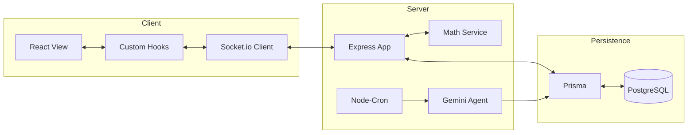
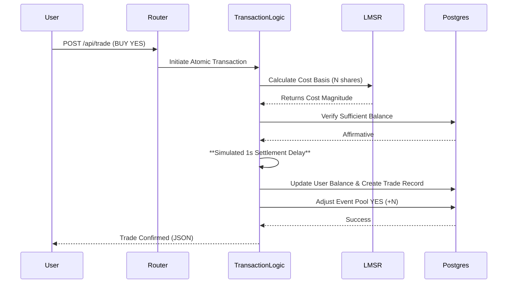

# Technical Architecture: Optima Markets

Optima Markets is a high-performance event prediction platform engineered with a distributed micro-service philosophy, utilizing a React frontend and Node.js/Express backend, persisted via PostgreSQL and Prisma ORM.

---

## 🏛️ System Overview

### High-Level Data Flow

---

## 🚀 Frontend Architecture (React)

### 1. Atomic Component Design
The frontend utilizes a modular component architecture based on atomic design principles, ensuring a consistent **Bloomberg Terminal** aesthetic across all views.
- **Header Layer**: Context-aware navigation with integrated balance and portfolio monitoring.
- **Market Card Layer**: Information-dense market visualization with real-time probability tickers.
- **Admin Layer**: Gated views for event lifecycle management.

### 2. Reactive Hooks Layer
Custom hooks manage the core business logic, abstracting API complexities from the presentation layer:
- `useMarkets`: Manages global market state, filtering, and real-time Socket.io probability sync.
- `usePortfolio`: Dynamically calculates PnL by aggregating trade history against current market prices.
- `useTrade`: Orchestrates complex trade execution, handling 1-second settlement delays and state synchronization.

---

## ⚙️ Backend Architecture (Express & Node.js)

### 1. Modular Controller Structure
The backend is organized into domain-specific route controllers:
- **Trade Controller**: Implements a strict atomic transaction pattern (`prisma.$transaction`) to prevent race conditions during heavy volume.
- **Admin Controller**: Manages the `PENDING -> ACTIVE` transition and resolving markets.
- **Market Controller**: Optimized for high-throughput reads of active prediction events.

### 2. Transaction Flow (Sequence Diagram)

---

## 📉 Quantitative Engine: LMSR Algorithm

Optima Markets utilizes the **Logarithmic Market Scoring Rule (LMSR)** as its core Automated Market Maker (AMM).

### 1. Probability Inversion
The spot price ($Price_{yes}$) is defined as the marginal cost of buying an infinitesimally small number of YES shares:
$$Price_{yes} = \frac{e^{q_{yes}/B}}{e^{q_{yes}/B} + e^{q_{no}/B}}$$

### 2. Portfolio Valuation
Unlike a traditional stock portfolio, an Optima Markets portfolio is valued dynamically based on current market probabilities. A "YES" share is worth $P(yes)$ while a "NO" share is worth $1.0 - P(yes)$.

---

## 🤖 AI Integration: Autonomous Analyst

The system integrates an autonomous research agent using the **Google Gemini (LLM)** SDK.

### The Cron Lifecycle
1.  **Ingestion**: At 00:00 UTC, the `node-cron` daemon triggers the Gemini Agent.
2.  **Synthesis**: The agent scans global trends (finance, politics, tech) and synthesizes 3 engagement-optimized binary questions.
3.  **Persistance**: Proposals are saved as `PENDING` ensuring human-in-the-loop review.
4.  **Activation**: Upon Admin approval, the system initializes the LMSR liquidity pools ($poolYes=100$, $poolNo=100$).

---

## 💾 Persistence Layer (Prisma & PostgreSQL)
The relational schema leverages strict foreign key constraints and atomic operations:
- **User <-> Trade**: Historically tracks all entry and exit prices.
- **Event <-> Trade**: Maps every transaction to its specific prediction market.
- **User <-> Portfolio**: Aggregates live balances and equity.

---
